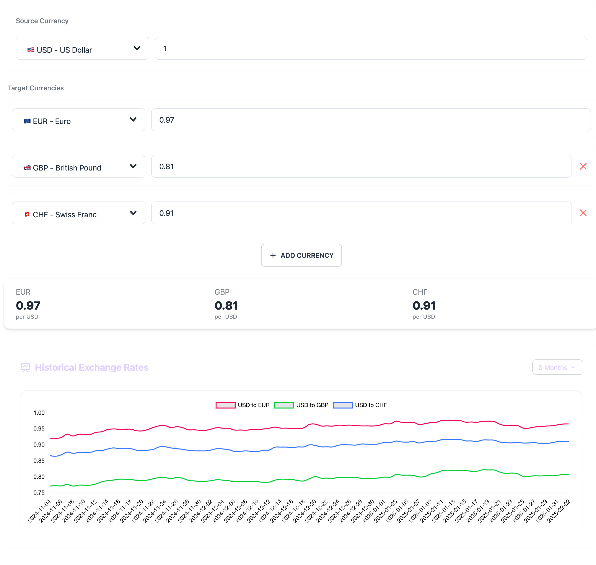

# Currency Exchange Web Application

A full-stack web application for real-time currency conversion and historical exchange rates tracking. Built with Nuxt.js for the frontend and Node.js/Express for the backend, featuring Redis caching for optimal performance.

## Architecture

- **Frontend**: Nuxt.js application with TypeScript
- **Backend**: Express.js REST API with Redis caching
- **Database**: Redis for caching exchange rates

## Screenshots


*Main dashboard showing current exchange rates*

## Project Structure

```
├── client/          # Nuxt.js frontend application
├── server/          # Express.js backend API
├── docs/           
│   └── screenshots/ # Application screenshots
└── README.md
```

## Getting Started

See individual README files in [client](./client) and [server](./server) directories for detailed setup instructions.

## License

MIT License - see LICENSE file for details.
